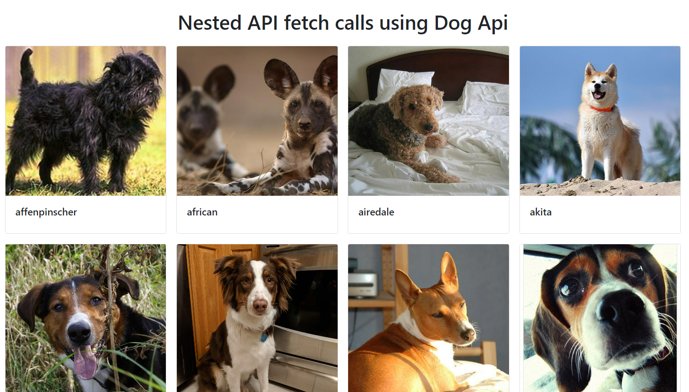

# Dog Api exercise - Render a list of cards

## Instructions
The objective of this exercise is to create a simple list of cards with dog images.
Each card will have as a title the name of the dog breed and the image will be a random image (everytime you refresh the page all images will change) corresponding to that breed.

To complete this exercise, open the file `main.js`, contained in the folder `starter-code` you SHOULD NOT change anything in the html file, just open it in your browser to see the results of your changes.
Add your code to main.js, reading carefully the comments at the top.

### Part 1 - Retrieve breed names

- Inside the `getDogs()` function, use the `fetch()` method to retrieve all the names of breeds from the Dog Api, [**revise the documentation**](https://dog.ceo/dog-api/) to understand which is the right endpoint for this purpose.
- Use the retrieved breed names to generate the HTML code for each breed card. Each card should have the breed name as its title and `alt` attribute of the `` tag.
- The `src` attribute of the `` tag should be empty for now. More help on this in the comments at the top of code.

### Part 2 - Retrieve a random image for each breed
#### Version 1: Nested api calls (easier, but not best practice*)

For this part you should understand how to make nested api calls. 
- Inside the `.forEach` method you used in the first part of the exercise to generate all cards for breeds, you should insert a fetch call to the api endpoint that gets a random image for a specific breed (again, look carefully for this endpoint by examining the documentation)
- you should use the breedName as a query param for the endpoint you'll be calling
- in the second `.then` you'll get each url for the image in the `data.message` and so you should pass each url as the `src` for the `` tag.

*A nested fetch API call is not considered best practice because it can lead to performance issues and make code difficult to read and maintain. When you make a nested fetch call, you are essentially making multiple HTTP requests, which can slow down the application's performance, especially if the network connection is slow or the server response time is high. Additionally, nested fetch calls can create a callback hell situation, where the code becomes difficult to read and understand, as well as difficult to debug and maintain.

#### Version 2: Promise.all (more advanced - best practice)

To retrieve random images for each one of the breeds, you can use the `Promise.all`. `Promise.all` is a method that takes an array of promises and returns a promise that is resolved when all of the promises in the array are resolved.
For this exercise, you'll need to modify some parts of the previous version, as we will use map instead of forEach. 

- After transforming the data for breedNames into an array using Object.keys(), create a variable `promises` which will be an array obtained using the map() method on breedNames.Each breedName corresponds to a fetch() request for a random image of a specific breed. Once the request has been completed, the promise resolves to an HTML template string representing a breed card with the corresponding image and breed name.

- Once all the promises have resolved using `Promise.all(promises)`, the resulting array of breed card HTML strings should be passed to the .then() method, which adds the HTML for all the breed cards at once to the web page.

Beware this time, before adding these cards to the container element, we need to concatenate all the strings in the array into one big string, because the innerHTML property of an HTML element only accepts a single string of HTML markup (we are basically making a very long string with the HTML for ALL the different cards, and injecting it into the `container-grid`) The `join('')` method should be used to concatenate all the strings in the array into one big string with no separator between them (or you will see strange commas appearing on your page between a card and the other).
